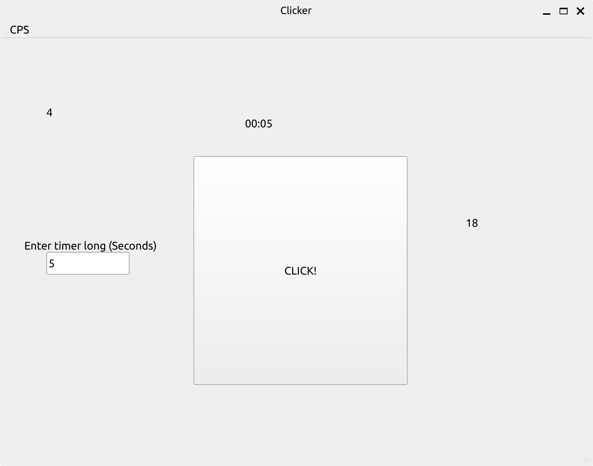

# Qt-CPS-Checker

A lightweight and efficient **Clicks Per Second (CPS)** tester built with **C++** and the **Qt Framework**.

## Description
Qt-CPS-Checker allows users to measure their clicking speed over a custom duration. It features a straightforward GUI and precise real-time tracking. This version (1.0.0) includes a functional "Small GUI," with a more advanced interface planned for future updates.

## Features
* **Custom Timer:** Set the duration of the test in seconds.
* **Real-time Counter:** Tracks every click instantly.
* **Live Countdown:** Displays the remaining time during the session.
* **Cross-platform:** Can be compiled on Windows, Linux, and macOS thanks to Qt and CMake.

## Clicker Preview

*(Note: Ensure the image path matches the file in your `img` folder)*

## Tech Stack
* **Language:** C++
* **Framework:** Qt (Widgets)
* **Build System:** CMake

## Build & Installation

### Prerequisites
Make sure you have the following installed:
* **Qt SDK** (5.15 or 6.x recommended)
* **CMake** 3.10 or higher
* A C++ compiler (MSVC, GCC, or Clang)

### Compilation Steps
1. **Clone the repository:**
   ```bash
   git clone https://github.com/rukiamuq-hard/Qt-CPS-Checker.git
2. **Open directory**
   ```bash
   cd Qt-CPS-Checker
3. **Build the project**
   ```bash
   mkdir build && cd build
   cmake ..
   cmake --build .
